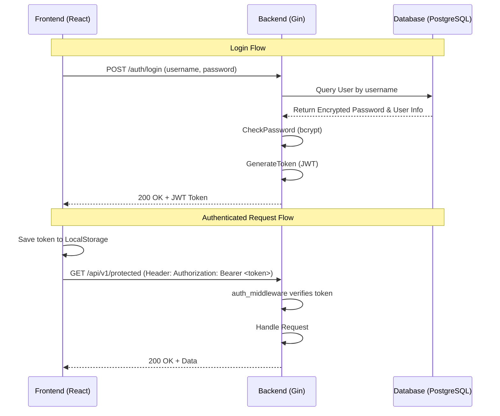

# Phase 2: Authentication (Đăng nhập / Đăng ký)

## ✅ TRẠNG THÁI: HOÀN THÀNH — 2026-07-29

**Thời gian dự kiến:** ~2-3 ngày  
**Thời gian thực tế:** Hoàn thành trước Phase 3

## 📋 Tóm Tắt Kết Quả (Implementation Summary)

### Backend Files Đã Tạo
| File | Trạng thái | Mô tả |
| :--- | :---: | :--- |
| `internal/dto/auth_dto.go` | ✅ Tạo mới (Cập nhật ở Phase 5) | `RegisterRequest` (thêm `Phone`), `LoginRequest`, `LoginResponse` |
| `internal/repos/user_repo.go` | ✅ Tạo mới | FindByUsername, FindByEmail, Create, FindByID |
| `internal/services/auth_service.go` | ✅ Tạo mới (Cập nhật ở Phase 5) | Register (bcrypt hash + **auto-create Patient record** kèm `Phone`), Login (bcrypt compare + JWT), bảo vệ Admin tự đăng ký. Thêm `ForgotPassword`, `ResetPassword` |
| `pkg/utils/jwt.go` | ✅ Tạo mới | GenerateToken, ValidateToken, ExtractClaims |
| `pkg/utils/password.go` | ✅ Tạo mới | HashPassword, CheckPassword |
| `internal/middlewares/auth_middleware.go` | ✅ Tạo mới | RequireAuth() — xác thực JWT Bearer token |
| `internal/controllers/auth_controller.go` | ✅ Tạo mới | Register handler (201), Login handler (200 + token) |
| `pkg/database/seed.go` | ✅ Cập nhật | Auto-seed 3 tài khoản demo: admin/doctor/patient (password: `123456`) |

### Frontend Files Đã Tạo/Cập Nhật
| File | Trạng thái | Mô tả |
| :--- | :---: | :--- |
| `src/types/user.ts` | ✅ Cập nhật | User, LoginResponse interfaces |
| `src/services/api.ts` | ✅ Cập nhật | Axios interceptor tự động gắn JWT token |
| `src/services/authService.ts` | ✅ Cập nhật | login(), register(), logout() gọi API thật |
| `src/stores/authStore.ts` | ✅ Cập nhật | Zustand: login, logout, checkAuth, localStorage persistence |
| `src/pages/LoginPage.tsx` | ✅ Cập nhật | Form AntD, gọi authStore.login, redirect /dashboard |
| `src/pages/RegisterPage.tsx` | ✅ Cập nhật (Cập nhật ở Phase 5) | Form AntD (chỉ doctor/patient — Admin bị chặn cả FE lẫn BE). **Thêm ô nhập Số điện thoại** để Bác sĩ tìm kiếm bệnh nhân |
| `src/components/layout/ProtectedRoute.tsx` | ✅ Tạo mới | Guard redirect /login nếu chưa xác thực |

### Tính Năng Bảo Mật Đặc Biệt
- ✅ **Chặn Admin tự đăng ký:** Frontend không có option `admin`, Backend trả lỗi 400 nếu `role=admin` được gửi lên
- ✅ **Nil pointer panic fix:** `auth_service.Login()` kiểm tra `user == nil` trước khi dùng, tránh runtime panic
- ✅ **Demo Accounts Auto-seed:** `admin/123456`, `doctor/123456`, `patient/123456` tự động tạo khi khởi động server
- ✅ **Auto-link Patient Record** *(bổ sung ở Phase 5):* Khi Bệnh nhân đăng ký tài khoản mới, hệ thống tự động tạo bản ghi `patients` có `user_id` nối sang tài khoản và lưu `Phone`

---

## Tổng quan
Giai đoạn Authentication (Xác thực người dùng) là module cốt lõi đầu tiên cần hoàn thiện để bảo vệ dữ liệu y tế của MedVisionHub. Phase này thiết lập luồng Đăng ký (Register) và Đăng nhập (Login) bằng phương pháp **JWT (JSON Web Token)**. Hệ thống sẽ băm mật khẩu người dùng trước khi lưu trữ (sử dụng bcrypt), sinh token khi đăng nhập hợp lệ, và sử dụng middleware trên backend để bảo vệ các endpoints cần thiết. Trên Frontend, React sẽ quản lý trạng thái xác thực bằng Zustand và điều hướng người dùng bằng React Router dựa trên state này.

## 🧑💻 Phân Công Nhiệm Vụ

| Người | Feature | Backend tasks | Frontend tasks | Ước tính |
|-------|---------|---------------|----------------|----------|
| 👤 A | Đăng Ký (Register) | password utils, user_repo, auth_service Register(), RegisterHandler, route | RegisterPage.tsx | 1-1.5 ngày |
| 👤 B | Đăng Nhập (Login) + JWT | jwt utils, auth_service Login(), LoginHandler, JWT middleware | LoginPage.tsx, authStore.ts, ProtectedRoute, authService.ts, Header update | 1-1.5 ngày |
| 👥 A + B | Integration | - | - | 0.5 ngày |

## Mục tiêu
1. **Bảo mật:** (👤 A - BE) Lưu trữ mật khẩu an toàn (Bcrypt). (👤 B - BE) Tạo và xác thực JWT token an toàn.
2. **Đăng ký:** (👤 A - BE, 👤 A - FE) Người dùng mới có thể đăng ký tài khoản (chọn vai trò là Bác sĩ hoặc Bệnh nhân - Admin sẽ được tạo thủ công hoặc qua script riêng). Đảm bảo không trùng Username hoặc Email.
3. **Đăng nhập:** (👤 B - BE, 👤 B - FE) Người dùng đăng nhập bằng Username và Password. Hệ thống trả về User Profile và JWT Token.
4. **Trải nghiệm người dùng:** (👤 B - FE, 👤 A - FE) Giao diện Ant Design Form có validation rõ ràng. Tự động chuyển hướng trang nếu chưa đăng nhập. Lưu phiên đăng nhập (LocalStorage).

## Yêu cầu trước (Prerequisites)
- [ ] (👥 A + B) Hoàn thành toàn bộ **Phase 1: Project Setup & Boilerplate**.
- [ ] (👤 A - BE) Database PostgreSQL đã có các bảng `users`, `roles`.
- [ ] (👥 A + B) API Contracts cho `POST /auth/register` và `POST /auth/login` đã được định nghĩa.

---

## Danh sách công việc chi tiết

### A. Backend Tasks (Golang + Gin)

1. **Cài đặt thư viện bảo mật** (👤 B - BE)
   - Chạy lệnh: `go get github.com/golang-jwt/jwt/v5 golang.org/x/crypto/bcrypt`

2. **Định nghĩa DTO (Data Transfer Object)** (👤 A - BE, 👤 B - BE)
   - Tạo file `internal/dto/auth_dto.go`.
   - (👤 A - BE) Định nghĩa struct `RegisterRequest` (Username, Password, Email, FullName, RoleID).
   - (👤 B - BE) Định nghĩa struct `LoginRequest` (Username, Password).
   - (👤 B - BE) Định nghĩa struct `LoginResponse` (Token, User{ID, Username, RoleName, FullName}).

3. **Cài đặt Utils cho Hash và JWT**
   - (👤 A - BE) Tạo file `pkg/utils/password.go`: Hàm `HashPassword(password string) (string, error)` và `CheckPassword(password, hash string) bool`.
   - (👤 B - BE) Tạo file `pkg/utils/jwt.go`: 
     - Hàm `GenerateToken(userID uint, username, role string) (string, error)` (Thiết lập cấu trúc Claims bao gồm: `user_id`, `username`, `role_name`, và `exp` - Hết hạn sau 24 giờ).
     - Hàm `ValidateToken(tokenString string) (*jwt.Token, error)`.
     - Hàm `ExtractClaims(token *jwt.Token) (jwt.MapClaims, error)`.

4. **Xây dựng Data Access Layer (Repository)** (👤 A - BE)
   - Tạo file `internal/repos/user_repo.go`.
   - Implement các hàm giao tiếp với GORM:
     - `FindByUsername(username string) (*models.User, error)`
     - `FindByEmail(email string) (*models.User, error)`
     - `Create(user *models.User) error`
     - `FindByID(id uint) (*models.User, error)`

5. **Xây dựng Business Logic (Service)**
   - Tạo file `internal/services/auth_service.go`.
   - (👤 A - BE) Implement `Register(req dto.RegisterRequest) error`:
     - Kiểm tra trùng lặp Username hoặc Email qua UserRepo.
     - Nếu trùng trả về lỗi HTTP 409 (Conflict).
     - Băm mật khẩu bằng `utils.HashPassword`.
     - Gán Default Role (Ví dụ: kiểm tra RoleID tồn tại, hoặc mặc định gán Role 'patient').
     - Gọi `UserRepo.Create`.
   - (👤 B - BE) Implement `Login(req dto.LoginRequest) (*dto.LoginResponse, error)`:
     - Tìm user bằng `UserRepo.FindByUsername`.
     - So sánh mật khẩu bằng `utils.CheckPassword`.
     - Lấy thông tin Role của user đó.
     - Gọi `utils.GenerateToken` tạo JWT.
     - Trả về đối tượng `LoginResponse`.

6. **Xây dựng API Endpoints (Controller)**
   - Tạo file `internal/controllers/auth_controller.go`.
   - (👤 A - BE) Implement handler `Register(c *gin.Context)`: Parse JSON body, gọi AuthService, trả về status 201 Created.
   - (👤 B - BE) Implement handler `Login(c *gin.Context)`: Parse JSON body, gọi AuthService, trả về status 200 OK kèm token.

7. **Xây dựng Middleware bảo vệ Route** (👤 B - BE)
   - Tạo file `internal/middlewares/auth_middleware.go`.
   - Implement `RequireAuth()` middleware: Lấy token từ header `Authorization: Bearer <token>`, gọi `utils.ValidateToken`, đưa thông tin user vào `c.Set("user_id", id)`, v.v. Nếu lỗi, trả về HTTP 401 Unauthorized.

8. **Đăng ký Routes**
   - Sửa file `cmd/main.go`.
   - (👤 A - BE) Tạo group route `api/v1/auth`.
   - (👤 A - BE) Map `POST /api/v1/auth/register` tới `AuthController.Register`.
   - (👤 B - BE) Map `POST /api/v1/auth/login` tới `AuthController.Login`.

---

### B. Frontend Tasks (ReactJS + Zustand)

1. **Cập nhật Types & Services**
   - (👤 A - FE, 👤 B - FE) Kiểm tra `types/user.ts`: Đảm bảo `User` type và `LoginResponse` khớp với DTO của Backend.
   - (👤 A - FE) Sửa `services/authService.ts`: Cập nhật hàm register để sử dụng `api.post('/auth/register', data)`.
   - (👤 B - FE) Sửa `services/authService.ts`: Cập nhật hàm login để sử dụng `api.post('/auth/login', data)` thay vì mock data. Bắt lỗi (try/catch) và throw error message từ backend.
   - (👤 B - FE) Cập nhật Interceptor trong `services/api.ts`: Đọc token từ localStorage và đính kèm vào header `Authorization: Bearer ${token}` cho mọi request (ngoại trừ auth). Nếu nhận HTTP 401 từ bất kỳ API nào, kích hoạt logout.

2. **Cập nhật Zustand Store** (👤 B - FE)
   - Mở `stores/authStore.ts`.
   - Triển khai hàm `login`: Lưu user data vào state, lưu token vào `localStorage.setItem('token', token)`.
   - Triển khai hàm `logout`: Xóa user khỏi state, gọi `localStorage.removeItem('token')`.
   - Triển khai hàm `checkAuth`: Kiểm tra localStorage khi app load, nếu có token thì set `isAuthenticated = true` (Tương lai có thể thêm API `/auth/me` để fetch lại profile chuẩn).

3. **Giao diện Đăng nhập & Đăng ký**
   - **`LoginPage.tsx`**: (👤 B - FE) Sử dụng Ant Design `<Form>`. Có input Username và Password. Bắt sự kiện `onFinish`. Gọi `authStore.login(values)`. Xử lý hiển thị Notification/Message lỗi nếu sai mật khẩu. Thành công -> `navigate('/dashboard')`.
   - **`RegisterPage.tsx`**: (👤 A - FE) Form đăng ký với các trường (Username, Email, Password, Confirm Password, Full Name, Role Selection). Validation Rule: Password và Confirm Password phải khớp. Email đúng định dạng. Gọi `authService.register(values)`. Thành công -> Thông báo và `navigate('/login')`.

4. **Quản lý Routes & Phân quyền UI** (👤 B - FE)
   - Tạo component `components/layout/ProtectedRoute.tsx`: Bọc các route cần đăng nhập (như `/dashboard`). Kiểm tra `authStore.isAuthenticated`, nếu `false` thì `<Navigate to="/login" replace />`.
   - Cập nhật `App.tsx` để bọc các Dashboard routes bằng `<ProtectedRoute>`.
   - Cập nhật **`Header.tsx`**: Đọc thông tin User từ Zustand. Hiển thị Avatar và Tên. Gắn sự kiện `onClick` cho nút Logout -> gọi `authStore.logout()` và điều hướng về `/login`.
   - (👥 A + B) Cập nhật **`Sidebar.tsx`**: Dựa vào `user.role`, ẩn/hiện các menu điều hướng không phù hợp (vd: Bệnh nhân không thấy trang Quản lý Role).

---

## API Endpoints Tóm tắt

| Method | Endpoint | Mô tả | Request Body | Response (Success) |
| :--- | :--- | :--- | :--- | :--- |
| `POST` | `/api/v1/auth/register` | Đăng ký tài khoản | `RegisterRequest` | `201 Created` |
| `POST` | `/api/v1/auth/login` | Đăng nhập lấy JWT | `LoginRequest` | `200 OK` (token, user) |

## Files cần tạo / chỉnh sửa

**Backend:**
- (👤 A - BE) `app/backend/internal/dto/auth_dto.go` (Tạo mới)
- (👤 A - BE) `app/backend/internal/repos/user_repo.go` (Tạo mới)
- (👤 A - BE, 👤 B - BE) `app/backend/internal/services/auth_service.go` (Tạo mới)
- (👤 B - BE) `app/backend/pkg/utils/jwt.go` (Tạo mới)
- (👤 A - BE) `app/backend/pkg/utils/password.go` (Tạo mới)
- (👤 B - BE) `app/backend/internal/middlewares/auth_middleware.go` (Tạo mới)
- (👤 A - BE, 👤 B - BE) `app/backend/internal/controllers/auth_controller.go` (Tạo mới)
- (👤 A - BE, 👤 B - BE) `app/backend/cmd/main.go` (Sửa đổi)

**Frontend:**
- (👤 A - FE, 👤 B - FE) `app/frontend/src/types/user.ts` (Sửa đổi)
- (👤 B - FE) `app/frontend/src/services/api.ts` (Sửa đổi)
- (👤 A - FE, 👤 B - FE) `app/frontend/src/services/authService.ts` (Sửa đổi)
- (👤 B - FE) `app/frontend/src/stores/authStore.ts` (Sửa đổi)
- (👤 B - FE) `app/frontend/src/pages/LoginPage.tsx` (Sửa đổi)
- (👤 A - FE) `app/frontend/src/pages/RegisterPage.tsx` (Sửa đổi)
- (👤 B - FE) `app/frontend/src/components/layout/ProtectedRoute.tsx` (Tạo mới)
- (👤 B - FE) `app/frontend/src/App.tsx` (Sửa đổi)
- (👤 B - FE) `app/frontend/src/components/layout/Header.tsx` (Sửa đổi)
- (👥 A + B) `app/frontend/src/components/layout/Sidebar.tsx` (Sửa đổi)

---

## Tiêu chí hoàn thành (Acceptance Criteria) & Checklist
- [x] (👤 A - BE, 👤 A - FE) **Đăng ký:** Đăng ký tài khoản mới thành công (HTTP 201), mật khẩu trong DB bị mã hóa Bcrypt. Đăng ký trùng Username/Email báo lỗi hợp lý (HTTP 409).
- [x] (👤 B - BE, 👤 B - FE) **Đăng nhập:** Đăng nhập bằng tài khoản vừa tạo thành công, trả về JWT. Đăng nhập sai báo lỗi HTTP 401.
- [x] (👤 B - BE, 👥 A + B) **Bảo vệ API:** Truy cập một API route bất kỳ được bảo vệ (sử dụng Auth Middleware) mà không có token (hoặc token sai) sẽ bị từ chối với HTTP 401.
- [x] (👤 B - FE) **Giao diện chặn truy cập (Guard):** Cố gắng truy cập URL `/dashboard` bằng trình duyệt khi chưa đăng nhập sẽ tự động redirect về `/login`.
- [x] (👤 B - FE) **Lưu phiên (Session Persistence):** Đăng nhập thành công -> F5 Refresh lại trình duyệt ở `/dashboard` -> Vẫn giữ trạng thái đăng nhập do token được lưu trong localStorage.
- [x] (👤 B - FE) **Đăng xuất (Logout):** Bấm nút Đăng xuất sẽ xóa token, reset Zustand state và chuyển về trang `/login`.
- [x] (👥 A + B) **Integration Test:** Đăng ký từ frontend -> tạo dữ liệu dưới BE -> Chuyển hướng trang login -> Đăng nhập thành công lấy token -> Vào được dashboard -> Cập nhật sidebar chính xác.

---

### Lưu đồ xác thực (Mermaid)

