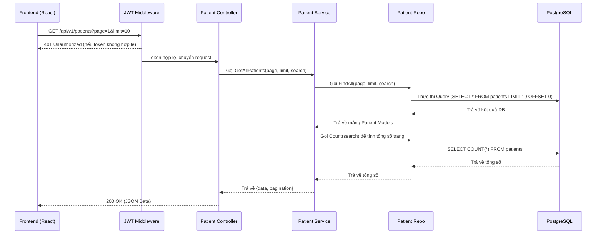

# Kế Hoạch Giai Đoạn 3: Quản Lý Bệnh Nhân (Patient Management CRUD)

**Thời gian dự kiến:** ~2-3 ngày
**Mục tiêu chính:** Cung cấp đầy đủ các chức năng CRUD (Create, Read, Update, Delete) cho đối tượng Bệnh nhân (Patient). Giúp các Bác sĩ và nhân viên y tế có thể tạo mới, xem chi tiết, chỉnh sửa thông tin, và xóa hồ sơ bệnh nhân trên hệ thống MedVisionHub.

---

## 🧑💻 Phân Công Nhiệm Vụ (Task Assignment)

Chiến lược phân công: Feature-based (Full-stack per person). Mỗi người chịu trách nhiệm cả Backend và Frontend cho tính năng của mình.

| Người | Feature | Backend tasks | Frontend tasks | Ước tính |
|-------|---------|---------------|----------------|----------|
| **👤 A** | Xem danh sách & Chi tiết | patient_repo (Read), patient_service (Get), patient_controller (GetAll, GetByID), GET routes | PatientListPage.tsx, PatientDetailPage.tsx, patientService getAll/getById, types, routes, sidebar | 1.5 ngày |
| **👤 B** | Tạo / Sửa / Xóa | patient_repo (Write: Create/Update/Delete), patient_service (Write), patient_controller (Create/Update/Delete), POST/PUT/DELETE routes | PatientForm.tsx (reusable modal), wire buttons in List/Detail pages, toast notifications | 1.5 ngày |
| **👥 A + B** | Integration & Testing | - | - | 0.5 ngày |

---

## 1. Tổng Quan Kiến Trúc (Mermaid Diagram)



---

## 2. Chi Tiết Các Tác Vụ Backend (Backend Tasks)

Trong phần này, chúng ta sẽ tuân thủ mô hình Clean Architecture đã được định nghĩa trong dự án MedVisionHub. Dưới đây là danh sách chi tiết các file cần tạo mới hoặc cập nhật.

### 2.1. Data Transfer Objects (DTOs)
**File cần tạo:** `app/backend/internal/dto/patient_dto.go`
*   **(👤 B) CreatePatientRequest**:
    *   `full_name` (string) - required (sử dụng tag `binding:"required"`)
    *   `date_of_birth` (string/date) - optional
    *   `gender` (string) - optional, valid values: `male`, `female`, `other`
    *   `phone` (string) - optional
    *   `address` (string) - optional
    *   `medical_history` (string) - optional
*   **(👤 B) UpdatePatientRequest**:
    *   Tương tự Create nhưng các field có thể là optional hết để hỗ trợ partial update.
*   **(👤 A) PatientResponse**:
    *   Map trực tiếp từ Patient model (ẩn các thông tin nhạy cảm nếu có).
    *   Bao gồm: `id`, `full_name`, `date_of_birth`, `gender`, `phone`, `address`, `medical_history`, `created_by`, `created_at`.
*   **(👤 A) PatientListResponse**:
    *   Chứa mảng `[]PatientResponse` và cấu trúc `Pagination` (gồm `page`, `limit`, `total`, `total_pages`).

### 2.2. Repositories (Database Access)
**File cần tạo:** `app/backend/internal/repos/patient_repo.go`
*   **(👤 A) FindAll(page int, limit int, search string) ([]models.Patient, error)**:
    *   Áp dụng GORM Scopes để phân trang (`Offset` và `Limit`).
    *   Tìm kiếm theo `full_name` hoặc `phone` sử dụng `LIKE %search%`.
*   **(👤 A) Count(search string) (int64, error)**:
    *   Đếm tổng số bệnh nhân thỏa mãn điều kiện tìm kiếm. Phục vụ việc tính toán `total_pages`.
*   **(👤 A) FindByID(id uint) (*models.Patient, error)**:
    *   Tìm theo ID.
    *   Sử dụng `.Preload("ScanSessions")` để lấy danh sách các ca chụp đi kèm.
*   **(👤 B) Create(patient *models.Patient) error**:
    *   Thêm mới bản ghi vào bảng `patients`.
*   **(👤 B) Update(patient *models.Patient) error**:
    *   Cập nhật thông tin bệnh nhân.
*   **(👤 B) Delete(id uint) error**:
    *   Xóa mềm (Soft delete nếu GORM cấu hình `gorm.DeletedAt`) hoặc xóa cứng. Cần đảm bảo logic về khóa ngoại.

### 2.3. Services (Business Logic)
**File cần tạo:** `app/backend/internal/services/patient_service.go`
*   **(👤 A) GetAllPatients(page, limit, search)**:
    *   Gọi `repo.FindAll` và `repo.Count`.
    *   Map mảng `models.Patient` sang mảng `dto.PatientResponse`.
    *   Tính toán `total_pages` = `math.Ceil(total / limit)`.
    *   Trả về struct chứa Data và Pagination.
*   **(👤 A) GetPatientByID(id)**:
    *   Gọi `repo.FindByID`. Xử lý lỗi nếu không tìm thấy (return error 404 Not Found).
    *   Map sang `dto.PatientResponse`.
*   **(👤 B) CreatePatient(req dto.CreatePatientRequest, createdByUserID uint)**:
    *   Khởi tạo `models.Patient` từ request, gán `created_by` = `createdByUserID`.
    *   Gọi `repo.Create`.
*   **(👤 B) UpdatePatient(id uint, req dto.UpdatePatientRequest)**:
    *   Đầu tiên gọi `repo.FindByID` để kiểm tra sự tồn tại.
    *   Cập nhật các trường thay đổi.
    *   Gọi `repo.Update`.
*   **(👤 B) DeletePatient(id uint)**:
    *   Kiểm tra xem bệnh nhân có đang có `scan_sessions` nào quan trọng không (tùy vào logic nghiệp vụ).
    *   Gọi `repo.Delete`.

### 2.4. Controllers (HTTP Handlers)
**File cần tạo:** `app/backend/internal/controllers/patient_controller.go`
*   **(👤 A) GetAll**:
    *   Lấy các tham số `page`, `limit`, `search` từ query param (dùng `c.Query` hoặc `c.DefaultQuery`).
    *   Parse sang số nguyên, gọi service.
    *   Trả về JSON `200 OK`.
*   **(👤 A) GetByID**:
    *   Lấy `id` từ `c.Param("id")`.
    *   Gọi service, trả về `200 OK` hoặc `404 Not Found`.
*   **(👤 B) Create**:
    *   Parse body JSON vào `dto.CreatePatientRequest` (dùng `c.ShouldBindJSON`).
    *   Lấy `userID` từ JWT context (đã set bởi middleware).
    *   Gọi service, trả về `201 Created`.
*   **(👤 B) Update**:
    *   Lấy `id` từ URL, parse JSON body.
    *   Gọi service, trả về `200 OK`.
*   **(👤 B) Delete**:
    *   Lấy `id` từ URL.
    *   Gọi service, trả về `200 OK` kèm message success.

### 2.5. Routes (Routing & Middleware)
**File cần cập nhật:** `app/backend/cmd/main.go` (hoặc file router riêng)
*   Thêm vào `api/v1` group:
    ```go
    v1 := r.Group("/api/v1")
    v1.Use(middlewares.JWTAuthMiddleware()) // Cần đăng nhập
    {
        patients := v1.Group("/patients")
        {
            patients.GET("", patientController.GetAll) // (👤 A)
            patients.GET("/:id", patientController.GetByID) // (👤 A)
            patients.POST("", patientController.Create) // (👤 B)
            patients.PUT("/:id", patientController.Update) // (👤 B)
            patients.DELETE("/:id", patientController.Delete) // (👤 B)
        }
    }
    ```

---

## 3. Chi Tiết Các Tác Vụ Frontend (Frontend Tasks)

### 3.1. Types & Interfaces
**File cần tạo:** `app/frontend/src/types/patient.ts`
*   **(👤 A)** Định nghĩa interface `Patient`: `id`, `fullName`, `dateOfBirth`, `gender`, `phone`, `address`, `medicalHistory`, `createdAt`.
*   **(👤 A)** Định nghĩa interface `PatientListResponse` (chứa `data` mảng Patient và `pagination` chứa thông trang).
*   **(👤 B)** Định nghĩa interface `CreatePatientRequest`, `UpdatePatientRequest`.

### 3.2. API Services
**File cần tạo:** `app/frontend/src/services/patientService.ts`
*   Sử dụng axios instance đã config sẵn (`api.ts`).
*   **(👤 A)** `getAll(page, limit, search)`: GET `/api/v1/patients`.
*   **(👤 A)** `getById(id)`: GET `/api/v1/patients/${id}`.
*   **(👤 B)** `create(data)`: POST `/api/v1/patients`.
*   **(👤 B)** `update(id, data)`: PUT `/api/v1/patients/${id}`.
*   **(👤 B)** `delete(id)`: DELETE `/api/v1/patients/${id}`.

### 3.3. Các Trang (Pages)
**File cần tạo:** `app/frontend/src/pages/PatientListPage.tsx`
*   **(👤 A) State Management**: Sử dụng React useState hoặc Zustand để lưu trữ danh sách patients, page hiện tại, search query, loading state.
*   **(👤 A) UI Components (Ant Design)**:
    *   **Thanh công cụ (Toolbar)**: Gồm một Input.Search (có debounce khoảng 300ms để tránh gọi API quá nhiều).
    *   **Bảng dữ liệu (Table)**: Cột hiển thị: STT, Họ và tên, Ngày sinh, Giới tính, Số điện thoại, Ngày tạo hồ sơ.
    *   **Phân trang (Pagination)**: Tích hợp với Table của Ant Design hoặc component Pagination riêng biệt.
*   **(👤 B) Tích hợp nút tạo/sửa/xóa**: 
    *   Thêm Button "Thêm bệnh nhân" (type="primary") vào Toolbar để mở Create Modal.
    *   Thêm cột Actions với 3 nút Icon: Xem chi tiết (EyeOutlined), Chỉnh sửa (EditOutlined), Xóa (DeleteOutlined). Wire các nút Chỉnh sửa và Xóa để gọi API Create/Update/Delete (kèm xác nhận Popconfirm khi xóa).
    *   Cập nhật danh sách sau khi Create/Update/Delete thành công, hiển thị Toast notification.

**File cần tạo:** `app/frontend/src/pages/PatientDetailPage.tsx`
*   **(👤 A) Layout**: Chia làm 2 phần chính.
*   **(👤 A) Phần 1: Thông tin bệnh nhân**: Một Card (Antd) hiển thị các thông tin chi tiết: Tên, Ngày sinh, Giới tính, Liên hệ, Tiền sử bệnh. 
*   **(👤 A) Phần 2: Lịch sử ca chụp (Scan Sessions)**: Một Table hiển thị danh sách các ca chụp của bệnh nhân (Lấy từ mảng `scan_sessions` được trả về qua API GetByID).
*   **(👤 A) Điều hướng**: Nút "Quay lại danh sách" ở góc trái màn hình.
*   **(👤 B) Tích hợp chỉnh sửa**: Thêm nút "Chỉnh sửa" ở góc trên Card để mở Update Modal và gọi API update.

### 3.4. Components
**File cần tạo:** `app/frontend/src/components/common/PatientForm.tsx`
*   **(👤 B)** Sử dụng Form của Ant Design.
*   **(👤 B)** Là một Reusable Component, có thể nhận vào prop `initialValues` (để dùng cho chức năng Edit) hoặc rỗng (chức năng Create).
*   **(👤 B)** Các trường: Họ tên (Input, Bắt buộc), Ngày sinh (DatePicker), Giới tính (Select: Nam, Nữ, Khác), Điện thoại (Input), Địa chỉ (Input), Tiền sử bệnh (TextArea).
*   **(👤 B)** Có nút Submit ("Lưu") và Cancel.
*   **(👤 B)** Component này sẽ được nhúng vào một Modal ở trang `PatientListPage` hoặc `PatientDetailPage`.

### 3.5. Cập nhật Router và Layout
*   **(👤 A) App.tsx**: Khai báo 2 Route mới:
    *   `<Route path="/patients" element={<PatientListPage />} />`
    *   `<Route path="/patients/:id" element={<PatientDetailPage />} />`
*   **(👤 A) Sidebar.tsx**: Bổ sung menu item "Quản lý Bệnh nhân" (icon Users, trỏ về `/patients`).

---

## 4. Tiêu Chí Nghiệm Thu (Acceptance Criteria) & Testing

### Tiêu Chí Kỹ Thuật (Technical Criteria)
1.  **(👥 A + B)** API tuân thủ đúng chuẩn RESTful.
2.  **(👥 A + B)** Mã nguồn Backend tổ chức đúng theo Clean Architecture (Controller -> Service -> Repo).
3.  **(👥 A + B)** Frontend áp dụng TypeScript strict type check, không có lỗi `any`.
4.  **(👥 A + B)** Giao diện hiển thị tốt, Ant Design được tích hợp chính xác.
5.  **(👤 A)** Search bệnh nhân phải có Debounce để tối ưu hiệu năng gọi API.

### Danh Sách Kiểm Tra (Testing Checklist)
- [ ] **(👤 B)** Backend: Thử nghiệm tạo bệnh nhân (thành công 201).
- [ ] **(👤 B)** Backend: Thử nghiệm tạo bệnh nhân thiếu field bắt buộc (trả về lỗi 400 Bad Request).
- [ ] **(👤 A)** Backend: Thử nghiệm lấy danh sách có phân trang và search.
- [ ] **(👤 B)** Backend: Thử nghiệm cập nhật thông tin bệnh nhân.
- [ ] **(👤 B)** Backend: Thử nghiệm xóa bệnh nhân.
- [ ] **(👤 A)** Frontend: Menu Sidebar dẫn tới đúng trang PatientList.
- [ ] **(👤 A)** Frontend: Table hiển thị đủ dữ liệu, chuyển trang hoạt động mượt mà.
- [ ] **(👤 A)** Frontend: Ô search hoạt động đúng, sau khi ngừng gõ 500ms mới gọi API.
- [ ] **(👤 B)** Frontend: Mở modal thêm mới, validate form bắt buộc nhập tên.
- [ ] **(👤 B)** Frontend: Lưu thành công, modal đóng lại và table tự động reload dữ liệu.
- [ ] **(👤 A)** Frontend: Click vào dòng bệnh nhân chuyển hướng sang trang Detail hiển thị đủ thông tin.
- [ ] **(👤 B)** Frontend: Xóa bệnh nhân hiển thị cảnh báo xác nhận.
- [ ] **(👥 A + B)** Integration: Test end-to-end CRUD flow.
- [ ] **(👥 A + B)** Integration: Cross-browser testing.
- [ ] **(👥 A + B)** Integration: Code review.

---

## 5. Danh Sách File Tổng Hợp (Tổng kết)

*Backend:*
- `/app/backend/internal/dto/patient_dto.go` **(👥 A + B)**
- `/app/backend/internal/repos/patient_repo.go` **(👥 A + B)**
- `/app/backend/internal/services/patient_service.go` **(👥 A + B)**
- `/app/backend/internal/controllers/patient_controller.go` **(👥 A + B)**
- Sửa đổi: `/app/backend/cmd/main.go` **(👥 A + B)**

*Frontend:*
- `/app/frontend/src/types/patient.ts` **(👥 A + B)**
- `/app/frontend/src/services/patientService.ts` **(👥 A + B)**
- `/app/frontend/src/pages/PatientListPage.tsx` **(👥 A + B)**
- `/app/frontend/src/pages/PatientDetailPage.tsx` **(👥 A + B)**
- `/app/frontend/src/components/common/PatientForm.tsx` **(👤 B)**
- Sửa đổi: `/app/frontend/src/App.tsx` **(👤 A)**
- Sửa đổi: `/app/frontend/src/components/layout/Sidebar.tsx` **(👤 A)**

Kế hoạch này đảm bảo việc xây dựng tính năng CRUD Bệnh nhân diễn ra bài bản, có cấu trúc chặt chẽ từ Backend đến Frontend, đồng thời đảm bảo chất lượng thông qua bộ testing checklist rõ ràng.
