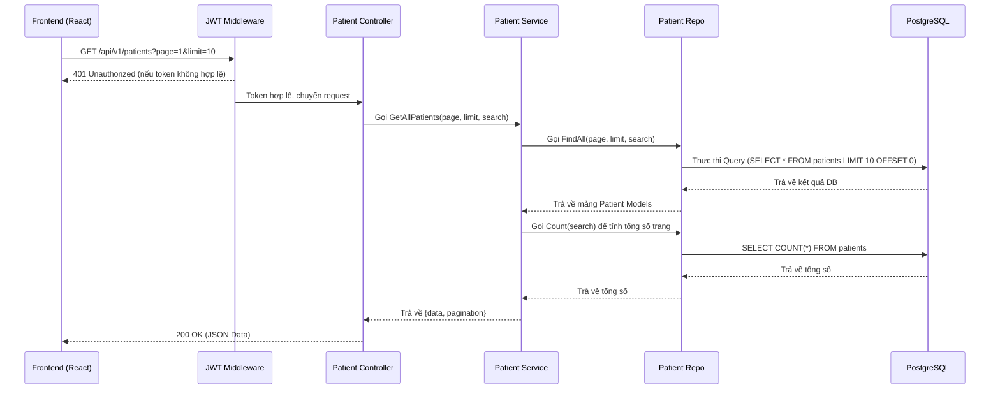

# Kế Hoạch Giai Đoạn 3: Quản Lý Bệnh Nhân (Patient Management CRUD)

**Thời gian dự kiến:** ~2-3 ngày
**Mục tiêu chính:** Cung cấp đầy đủ các chức năng CRUD (Create, Read, Update, Delete) cho đối tượng Bệnh nhân (Patient). Giúp các Bác sĩ và nhân viên y tế có thể tạo mới, xem chi tiết, chỉnh sửa thông tin, và xóa hồ sơ bệnh nhân trên hệ thống MedVisionHub.

---

## ⚠️ ZERO-CONFLICT RULE (Quy tắc tránh xung đột)
1. **Mỗi file chỉ có DUY NHẤT 1 người sửa** - Không bao giờ 2 người sửa cùng 1 file trong cùng 1 phase.
2. **Permanent File Ownership (Quyền sở hữu file cố định):**
   - **(👤 A) sở hữu**: `cmd/main.go` (đăng ký routes), `components/layout/Sidebar.tsx` (menu navigation)
   - **(👤 B) sở hữu**: `App.tsx` (React Router), `index.css`
3. **Mỗi module có file riêng biệt** - Không gộp chung.
4. Khi B cần thêm route vào `main.go`, B KHÔNG tự sửa mà gửi hướng dẫn cho A qua Slack/GitHub issue. Tương tự, khi A cần thêm route vào `App.tsx`, A gửi hướng dẫn cho B.

---

## 🧑💻 Phân Công Nhiệm Vụ (Task Assignment)

Chiến lược phân công: **Layer split - Zero conflict**. (👤 A) đảm nhận toàn bộ Backend, (👤 B) đảm nhận toàn bộ Frontend.

| Người | Vai trò | Phạm vi file | Ước tính |
|-------|---------|-------------|----------|
| **👤 A** | Backend Owner | Chỉ file .go | 1.5 ngày |
| **👤 B** | Frontend Owner | Chỉ file .ts/.tsx | 1.5 ngày |
| **👥 A + B** | Integration | Test kết nối | 0.5 ngày |

**File Ownership Table:**

| File | Owner | Action |
|------|-------|--------|
| internal/dto/patient_dto.go | 👤 A | Tạo mới |
| internal/repos/patient_repo.go | 👤 A | Tạo mới |
| internal/services/patient_service.go | 👤 A | Tạo mới |
| internal/controllers/patient_controller.go | 👤 A | Tạo mới |
| cmd/main.go | 👤 A | Cập nhật (thêm routes) |
| components/layout/Sidebar.tsx | 👤 A | Cập nhật (thêm menu) |
| types/patient.ts | 👤 B | Tạo mới |
| services/patientService.ts | 👤 B | Tạo mới |
| pages/PatientListPage.tsx | 👤 B | Tạo mới |
| pages/PatientDetailPage.tsx | 👤 B | Tạo mới |
| components/common/PatientForm.tsx | 👤 B | Tạo mới |
| App.tsx | 👤 B | Cập nhật (thêm routes) |

---

## 1. Tổng Quan Kiến Trúc (Mermaid Diagram)

---

## 2. Chi Tiết Các Tác Vụ Backend (Backend Tasks) - 👤 A

Tất cả code Backend sẽ do **(👤 A)** phụ trách. Không sửa bất kỳ file .ts/.tsx nào.

### 2.1. Data Transfer Objects (DTOs)
**File cần tạo:** `app/backend/internal/dto/patient_dto.go`
*   `CreatePatientRequest`, `UpdatePatientRequest` (tags cho validation, optional fields)
*   `PatientResponse`, `PatientListResponse`, `Pagination`

### 2.2. Repositories (Database Access)
**File cần tạo:** `app/backend/internal/repos/patient_repo.go`
*   `FindAll(page, limit, search)`: Dùng GORM phân trang, LIKE.
*   `Count(search)`: Tổng số bản ghi.
*   `FindByID(id)`: Lấy chi tiết, Preload.
*   `Create`, `Update`, `Delete` logic.

### 2.3. Services (Business Logic)
**File cần tạo:** `app/backend/internal/services/patient_service.go`
*   `GetAllPatients`, `GetPatientByID`, `CreatePatient`, `UpdatePatient`, `DeletePatient` logic.

### 2.4. Controllers (HTTP Handlers)
**File cần tạo:** `app/backend/internal/controllers/patient_controller.go`
*   `GetAll`, `GetByID`, `Create`, `Update`, `Delete` handlers.

### 2.5. Routes (Routing)
**File cần cập nhật:** `app/backend/cmd/main.go`
*   **(👤 A)** tự tay đăng ký các route CRUD cho Patient trong file này.

---

## 3. Chi Tiết Các Tác Vụ Frontend (Frontend Tasks) - 👤 B

Tất cả code Frontend sẽ do **(👤 B)** phụ trách. Không sửa bất kỳ file .go nào.

### 3.1. Types & Interfaces
**File cần tạo:** `app/frontend/src/types/patient.ts`
*   Khai báo `Patient`, `CreatePatientRequest`, `PatientListResponse`, `Pagination` interfaces.

### 3.2. API Services
**File cần tạo:** `app/frontend/src/services/patientService.ts`
*   Sử dụng axios để gọi `getAll`, `getById`, `create`, `update`, `delete`.

### 3.3. Các Trang (Pages)
**File cần tạo:** `app/frontend/src/pages/PatientListPage.tsx`
*   Dùng Ant Design Table, pagination, input search, nút thêm/sửa/xóa.
**File cần tạo:** `app/frontend/src/pages/PatientDetailPage.tsx`
*   Card thông tin bệnh nhân, bảng danh sách scan sessions, nút chỉnh sửa.

### 3.4. Components
**File cần tạo:** `app/frontend/src/components/common/PatientForm.tsx`
*   Reusable modal form (Antd) dùng cho Create và Edit.

### 3.5. Cập nhật Router và Layout
*   **App.tsx (👤 B):** B tự động thêm routes `/patients` và `/patients/:id`.
*   **Sidebar.tsx (👤 A):** A cập nhật thêm menu "Quản lý Bệnh nhân". B sẽ yêu cầu A làm việc này.

---

## 4. Tiêu Chí Nghiệm Thu (Acceptance Criteria) & Testing

### Tiêu Chí Kỹ Thuật (Technical Criteria)
1. API tuân thủ đúng chuẩn RESTful.
2. Mã nguồn Backend tổ chức đúng theo Clean Architecture (Controller -> Service -> Repo).
3. Frontend áp dụng TypeScript strict type check, không có lỗi `any`.
4. Giao diện hiển thị tốt, Ant Design được tích hợp chính xác.
5. Search bệnh nhân phải có Debounce.

### Danh Sách Kiểm Tra (Testing Checklist)
- [ ] **(👤 B)** Frontend: Khởi tạo các form, pages. Menu Sidebar hoạt động đúng (nhờ A update).
- [ ] **(👤 A)** Backend: Thử nghiệm tạo, đọc, sửa, xóa thành công, trả về đúng HTTP status (201, 200, 400).
- [ ] **(👥 A + B)** Integration testing: kết nối FE gọi BE, kiểm tra CRUD flow end-to-end, code review chéo.

---

## 5. Danh Sách File Tổng Hợp (Tổng kết)

*Backend (👤 A):*
- `/app/backend/internal/dto/patient_dto.go`
- `/app/backend/internal/repos/patient_repo.go`
- `/app/backend/internal/services/patient_service.go`
- `/app/backend/internal/controllers/patient_controller.go`
- `/app/backend/cmd/main.go` (Cập nhật)

*Frontend (👤 B - Trừ Sidebar do A phụ trách):*
- `/app/frontend/src/types/patient.ts`
- `/app/frontend/src/services/patientService.ts`
- `/app/frontend/src/pages/PatientListPage.tsx`
- `/app/frontend/src/pages/PatientDetailPage.tsx`
- `/app/frontend/src/components/common/PatientForm.tsx`
- `/app/frontend/src/App.tsx` (Cập nhật)
- `/app/frontend/src/components/layout/Sidebar.tsx` (👤 A cập nhật)
