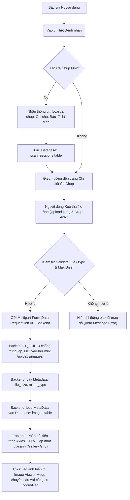

# Kế Hoạch Giai Đoạn 4: Ca Chụp Hình Ảnh & Tải Lên (Scan Sessions & Image Upload)

**Thời gian dự kiến:** ~2-3 ngày
**Mục tiêu chính:** Cho phép Bác sĩ tạo mới các ca chụp y tế (Scan Sessions) cho bệnh nhân. Cốt lõi của Phase này là tính năng Upload và Quản lý file hình ảnh y khoa.
**LƯU Ý QUAN TRỌNG:** Đây là mốc DEMO quan trọng của đồ án.

---

## ⚠️ ZERO-CONFLICT RULE (Quy tắc tránh xung đột)
1. **Mỗi file chỉ có DUY NHẤT 1 người sửa** trong phase này.
2. **Permanent File Ownership (Quyền sở hữu cố định):**
   - **(👤 A) sở hữu**: `cmd/main.go`
   - **(👤 B) sở hữu**: `App.tsx`
3. Phase 4 áp dụng **Module split**: A = Scan Module (BE+FE), B = Image Module (BE+FE). Các file của 2 module hoàn toàn tách biệt.
4. Đối với việc wire-up:
   - A cập nhật `main.go` để thêm CẢ Scan VÀ Image routes. (B gửi hướng dẫn route cho A).
   - B cập nhật `App.tsx` để thêm route `/scans/:id`.
   - A cập nhật `PatientDetailPage.tsx` (Thêm Scan table).
   - Integration: A import các UI components của B (`ImageGallery`, `ImageViewer`, `ImageUpload`) vào trang `ScanDetailPage.tsx` do A tạo.

---

## 🧑💻 Phân Công Nhiệm Vụ (Task Assignment)

| Người | Module | Backend files | Frontend files | Ước tính |
|-------|--------|--------------|----------------|----------|
| **👤 A** | Scan Sessions | scan_dto, scan_repo, scan_service, scan_controller | scan.ts, scanService.ts, ScanForm.tsx, ScanDetailPage.tsx | 1.5 ngày |
| **👤 B** | Image Upload | image_dto, image_repo, image_service, image_controller | image.ts, imageService.ts, ImageViewer.tsx, ImageUpload.tsx, ImageGallery.tsx | 1.5 ngày |
| **👥 A + B** | Integration | A imports B's components into ScanDetailPage | Test full flow | 0.5 ngày |

**File Ownership Table:**

| File | Owner | Action |
|------|-------|--------|
| internal/dto/scan_dto.go | 👤 A | Tạo mới |
| internal/repos/scan_session_repo.go | 👤 A | Tạo mới |
| internal/services/scan_service.go | 👤 A | Tạo mới |
| internal/controllers/scan_controller.go | 👤 A | Tạo mới |
| types/scan.ts | 👤 A | Tạo mới |
| services/scanService.ts | 👤 A | Tạo mới |
| components/common/ScanForm.tsx | 👤 A | Tạo mới |
| pages/ScanDetailPage.tsx | 👤 A | Tạo mới |
| pages/PatientDetailPage.tsx | 👤 A | Cập nhật (thêm scan table) |
| cmd/main.go | 👤 A | Cập nhật (thêm scan + image routes) |
| internal/dto/image_dto.go | 👤 B | Tạo mới |
| internal/repos/image_repo.go | 👤 B | Tạo mới |
| internal/services/image_service.go | 👤 B | Tạo mới |
| internal/controllers/image_controller.go | 👤 B | Tạo mới |
| types/image.ts | 👤 B | Tạo mới |
| services/imageService.ts | 👤 B | Tạo mới |
| components/common/ImageViewer.tsx | 👤 B | Tạo mới |
| components/common/ImageUpload.tsx | 👤 B | Tạo mới |
| components/common/ImageGallery.tsx | 👤 B | Tạo mới |
| App.tsx | 👤 B | Cập nhật (thêm /scans/:id route) |

---

## 1. Trọng Tâm Phiên Bản Demo (Demo Milestone Focus)

1.  **Giao diện Upload Mượt Mà:** Kéo thả, progress bar.
2.  **Trình Xem Ảnh Chuyên Nghiệp (Image Viewer):** Zoom in/out, xoay, fullscreen.
3.  **Validate File Nghiêm Ngặt:** Size limit, file type.
4.  **Tốc Độ Truy Xuất (Performance):** Thumbnail load nhanh.
5.  **Luồng Xóa (Delete Flow):** DB + Physical file deletion.

---

## 2. Chi Tiết Cấu Trúc Cơ Sở Dữ Liệu (Database Schema)

*   **(👤 A) Bảng `scan_sessions`:** `id`, `patient_id`, `doctor_id`, `scan_type`, `status`, `notes`
*   **(👤 B) Bảng `images`:** `id`, `session_id`, `file_name`, `file_url`, `file_size`, `mime_type`, `diagnostic_result`, `uploaded_by`

---

## 3. Chi Tiết Các Tác Vụ Backend (Backend Tasks)

### 3.1. Scan Module (👤 A)
*   **DTO:** `scan_dto.go` (CreateScanRequest, ScanResponse, ScanListResponse)
*   **Repo:** `scan_session_repo.go` (Create, FindAllByPatientID, FindByID, UpdateStatus)
*   **Service:** `scan_service.go` (CreateScan, GetScansByPatient, GetScanByID)
*   **Controller:** `scan_controller.go`
*   **Router:** `main.go` - A đăng ký cả Scan Routes VÀ Image Routes. (B phải gửi config cho A).

### 3.2. Image Module (👤 B)
*   **DTO:** `image_dto.go` (ImageResponse, ImageListResponse)
*   **Repo:** `image_repo.go` (Create, FindAllByScanID, Delete, FindByID)
*   **Service:** `image_service.go` (UploadImage với detect content type & UUID, GetImagesByScan, DeleteImage vật lý)
*   **Controller:** `image_controller.go` (Xử lý Multipart Form-Data)

---

## 4. Chi Tiết Các Tác Vụ Frontend (Frontend Tasks)

### 4.1. Scan Module (👤 A)
*   **Types & Service:** `scan.ts`, `scanService.ts`
*   **UI Components:** `ScanForm.tsx` (Loại Y tế, Ghi chú)
*   **Pages:** 
    *   `ScanDetailPage.tsx` (Trang mới hoàn toàn, chứa Header thông tin ca chụp). A sẽ import `ImageUpload` và `ImageGallery` của B vào đây ở bước Integration.
    *   `PatientDetailPage.tsx` (Cập nhật để thêm lưới danh sách ca chụp, nút Tạo mới).

### 4.2. Image Module (👤 B)
*   **Types & Service:** `image.ts`, `imageService.ts`
*   **UI Components:**
    *   `ImageUpload.tsx`: Vùng Drag & Drop, Validate client-side, hiển thị Upload Progress.
    *   `ImageGallery.tsx`: Lưới hiển thị Thumbnail.
    *   `ImageViewer.tsx`: Modal xem ảnh toàn màn hình với Zoom/Pan/Rotate.
*   **App.tsx:** B cập nhật để thêm route `/scans/:id`.

---

## 5. Tiêu Chí Nghiệm Thu (Acceptance Criteria) & Kịch Bản Thuyết Trình Testing (Demo Script)

1. Tạo ca chụp mới thành công, chuyển hướng đúng.
2. Upload file sai định dạng hoặc quá dung lượng phải báo lỗi đỏ ngay.
3. Upload nhiều file mượt mà, progress bar thật.
4. Image Viewer hoạt động tốt các tính năng Zoom/Rotate.
5. Xóa ảnh cập nhật UI và biến mất file vật lý trên server.

---

## 6. Tổng Kết Cấu Trúc Thư Mục & File Để Dev (Danh sách chuẩn xác)

*Scan Module (👤 A):*
- `app/backend/internal/dto/scan_dto.go`
- `app/backend/internal/repos/scan_session_repo.go`
- `app/backend/internal/services/scan_service.go`
- `app/backend/internal/controllers/scan_controller.go`
- `app/frontend/src/types/scan.ts`
- `app/frontend/src/services/scanService.ts`
- `app/frontend/src/components/common/ScanForm.tsx`
- `app/frontend/src/pages/ScanDetailPage.tsx`
- `app/frontend/src/pages/PatientDetailPage.tsx` (Cập nhật)
- `app/backend/cmd/main.go` (Cập nhật routes)

*Image Module (👤 B):*
- `app/backend/internal/dto/image_dto.go`
- `app/backend/internal/repos/image_repo.go`
- `app/backend/internal/services/image_service.go`
- `app/backend/internal/controllers/image_controller.go`
- `app/frontend/src/types/image.ts`
- `app/frontend/src/services/imageService.ts`
- `app/frontend/src/components/common/ImageUpload.tsx`
- `app/frontend/src/components/common/ImageGallery.tsx`
- `app/frontend/src/components/common/ImageViewer.tsx`
- `app/frontend/src/App.tsx` (Cập nhật routes)
