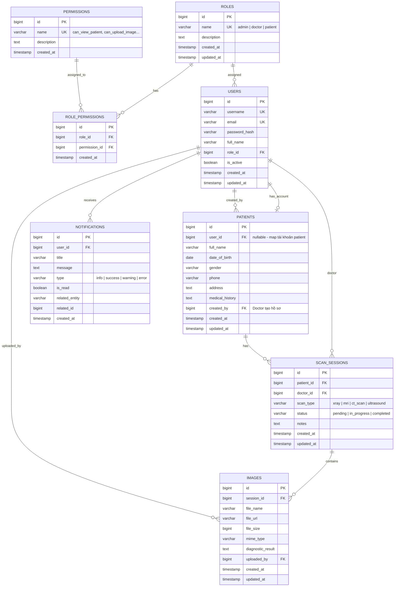

# 🗄️ Database ERD - MedVision Hub

## Entity Relationship Diagram

---

## Mô tả Quan hệ (Relationships)

| Quan hệ                          | Loại        | Mô tả                                                    |
| --------------------------------- | ----------- | --------------------------------------------------------- |
| Roles ↔ Permissions              | Many-to-Many| Qua bảng trung gian `role_permissions`                    |
| Roles → Users                    | One-to-Many | Mỗi user có 1 role, 1 role có nhiều users                |
| Users → Patients (user_id)       | One-to-One  | Bệnh nhân có thể map với 1 tài khoản (optional)          |
| Users → Patients (created_by)    | One-to-Many | 1 bác sĩ tạo nhiều hồ sơ bệnh nhân                      |
| Users → Scan_Sessions (doctor_id)| One-to-Many | 1 bác sĩ thực hiện nhiều ca chụp                         |
| Patients → Scan_Sessions         | One-to-Many | 1 bệnh nhân có nhiều ca chụp                             |
| Scan_Sessions → Images           | One-to-Many | 1 ca chụp có nhiều hình ảnh                               |
| Users → Images (uploaded_by)     | One-to-Many | 1 user upload nhiều ảnh                                   |
| Users → Notifications            | One-to-Many | 1 user nhận nhiều thông báo                               |

---

## Ghi chú thiết kế

1. **Soft Delete:** Hiện tại chưa implement soft delete. Nếu cần sau này, thêm cột `deleted_at TIMESTAMP NULL` vào các bảng `users`, `patients`, `scan_sessions`, `images`.

2. **Bảng `patients` tách riêng khỏi `users`:** Cho phép bác sĩ tạo hồ sơ bệnh nhân mà bệnh nhân chưa cần có tài khoản. Nếu bệnh nhân muốn tự đăng nhập xem kết quả, admin sẽ tạo tài khoản và link `user_id`.

3. **Cột `related_entity` + `related_id` trong `notifications`:** Dùng polymorphic association đơn giản để link notification tới entity cụ thể (VD: click notification → mở trang scan detail).

4. **Index strategy:**
   - `users`: index trên `email`, `username` (unique lookup khi login)
   - `scan_sessions`: index trên `patient_id`, `doctor_id` (query theo bệnh nhân/bác sĩ)
   - `images`: index trên `session_id` (load ảnh theo ca chụp)
   - `notifications`: composite index trên `[user_id, is_read]` (query thông báo chưa đọc)
